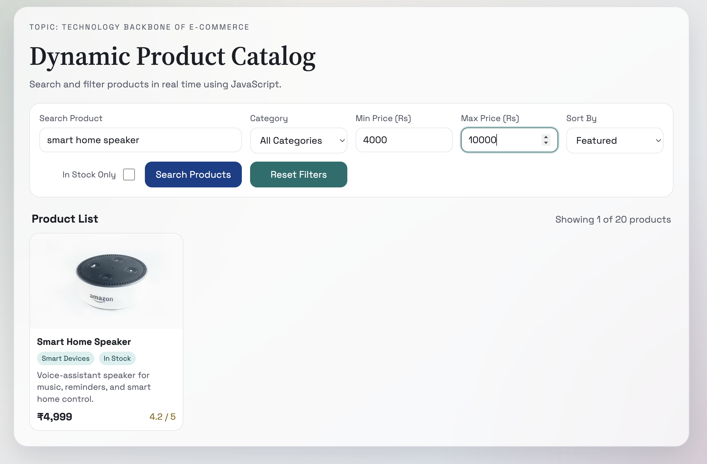

# Lab Assignment 2: Implementing Product Listing and Search Functionality

**Topic:** Technology Backbone of E-Commerce
**Reference:** Schneider – Chapter 4
**Tools:** JavaScript, HTML, CSS

---

## Objective

Develop a dynamic product catalog with search and filter features using JavaScript to demonstrate front-end e-commerce functionality and user interaction patterns.

---

## Project Overview

This assignment implements a fully functional **Dynamic Product Catalog** application that allows users to:
- Search products by name, category, or description
- Filter products by category, price range, and stock availability
- Sort products by various criteria (price, rating, name)
- View real-time results with smooth animations

The application demonstrates key e-commerce technologies including dynamic rendering, client-side filtering, and responsive design patterns.

---

## Features

### 1. **Search Functionality**
- Real-time search across product name, category, and description
- Instant results as user types
- Keyboard support (Enter key to search)

### 2. **Multi-Criteria Filtering**
- **Category Filter**: Select from dynamically populated categories (Audio, Wearables, Accessories, Cameras, Smart Devices, Displays, Storage)
- **Price Range Filter**: Set minimum and maximum price bounds
- **Stock Availability**: Toggle to show only in-stock products

### 3. **Sorting Options**
- Featured (default)
- Price: Low to High
- Price: High to Low
- Top Rated (by rating)
- Name: A to Z

### 4. **User Interface**
- Clean, modern design with gradient backgrounds
- Product cards displaying:
  - Product image
  - Product name
  - Category badge
  - Stock status (In Stock / Out of Stock)
  - Description
  - Price in Indian Rupees (₹)
  - Rating (out of 5)
- Smooth fade-in animations for product cards
- Responsive layout
- Results counter showing filtered products

### 5. **Interactive Controls**
- Search button for manual search trigger
- Reset button to clear all filters
- All filters work independently and in combination

---

## Technologies Used

- **HTML5**: Semantic structure and accessibility features
- **CSS3**: Modern styling with custom properties, gradients, and animations
- **JavaScript (ES6+)**:
  - DOM manipulation
  - Event handling
  - Array methods (filter, sort, map)
  - Template literals
  - Internationalization API for currency formatting

---

## Implementation Details

### File Structure

```
Assignment-2/
├── index.html          # Main HTML structure
├── style.css           # Styles and animations
├── data.js             # Product data array (20 products)
├── script.js           # Application logic and event handlers
├── screenshot.png      # UI screenshot
└── Readme.md          # This file
```

### Key Components

#### 1. **Data Layer** (`data.js`)
- Contains `PRODUCTS` array with 20 sample products
- Each product has: id, name, category, price, rating, inStock status, image, description

#### 2. **Application Logic** (`script.js`)
- **`getFilterState()`**: Captures current filter values from UI
- **`applyFilters()`**: Filters products based on search query, category, price range, and stock
- **`sortProducts()`**: Implements sorting logic for different criteria
- **`renderProducts()`**: Dynamically generates product cards in the DOM
- **`updateCatalog()`**: Main function that orchestrates filtering, sorting, and rendering
- **`populateCategoryFilter()`**: Dynamically builds category dropdown from product data
- **`bindEvents()`**: Attaches event listeners to all interactive elements

#### 3. **User Interface** (`index.html` + `style.css`)
- Semantic HTML with ARIA labels for accessibility
- Flexbox/Grid layout for responsive design
- Custom CSS properties for theming
- Google Fonts (Space Grotesk, Source Serif 4)
- Smooth animations using CSS keyframes

### Core JavaScript Concepts Demonstrated

1. **DOM Manipulation**: Dynamic element creation and updating
2. **Event Handling**: Multiple event types (click, input, change, keydown)
3. **Array Methods**: filter(), sort(), map(), forEach()
4. **Functional Programming**: Pure functions for filtering and sorting
5. **String Manipulation**: toLowerCase(), trim(), includes()
6. **Number Handling**: Price parsing and validation
7. **Internationalization**: Currency formatting with `Intl.NumberFormat`
8. **Template Literals**: Dynamic HTML generation

---

## How to Run

1. **Clone or download** the Assignment-2 folder
2. **Open `index.html`** in a modern web browser (Chrome, Firefox, Safari, Edge)
3. **No server required** - runs entirely in the browser

### Browser Requirements
- Modern browser with ES6+ support
- JavaScript enabled
- Internet connection (for Google Fonts and product images from Unsplash)

---

## Usage Instructions

1. **Search Products**: Type keywords (e.g., "camera", "wireless", "smart") in the search box
2. **Filter by Category**: Select a category from the dropdown
3. **Set Price Range**: Enter min/max prices (in Rupees)
4. **Toggle Stock Filter**: Check "In Stock Only" to hide out-of-stock items
5. **Sort Results**: Choose sorting criteria from the Sort By dropdown
6. **Reset Everything**: Click "Reset Filters" to clear all filters and show all products

---

## Screenshots

### Main Interface


*Showing search controls, filters, and product grid with real-time results*

---

## Product Data

The catalog includes **20 products** across **6 categories**:
- **Audio** (3 products): Headphones, Speakers, Earbuds
- **Wearables** (2 products): Fitness Watch, VR Headset
- **Accessories** (5 products): Keyboards, Mice, Hubs, Pen Tablets
- **Cameras** (4 products): Action Camera, Lenses, Webcam, Gimbal
- **Smart Devices** (4 products): E-Reader, Security Camera, Speaker, Tablet
- **Displays** (1 product): Gaming Monitor
- **Storage** (1 product): Portable SSD

Price range: ₹1,499 - ₹17,999

---

## Learning Outcomes

This assignment demonstrates understanding of:

1. **E-Commerce Front-End Architecture**
   - Product catalog structure
   - Search and filter patterns
   - Sorting mechanisms

2. **JavaScript Fundamentals**
   - Event-driven programming
   - Data manipulation and transformation
   - Dynamic UI updates

3. **User Experience Design**
   - Responsive layouts
   - Real-time feedback
   - Loading states and empty states

4. **Best Practices**
   - Semantic HTML
   - Accessibility considerations (ARIA labels)
   - Code organization and modularity
   - Performance optimization (lazy loading images)

---

## Future Enhancements (Optional)

- Add shopping cart functionality
- Implement pagination for large catalogs
- Add product detail modal/page
- Save filters to localStorage
- Implement "Add to Wishlist" feature
- Add product comparison feature
- Integrate with backend API and database

---

## Author

**Course:** Technology Backbone of E-Commerce
**Assignment:** Lab Assignment 2
**Date:** 2026

---

## References

- Schneider, Gary P. *Electronic Commerce* - Chapter 4: Technology Infrastructure for E-Commerce
- MDN Web Docs - JavaScript Array Methods
- Modern JavaScript Techniques for E-Commerce Applications

---

## License

This project is created for educational purposes as part of the E-Commerce Technology course curriculum.
