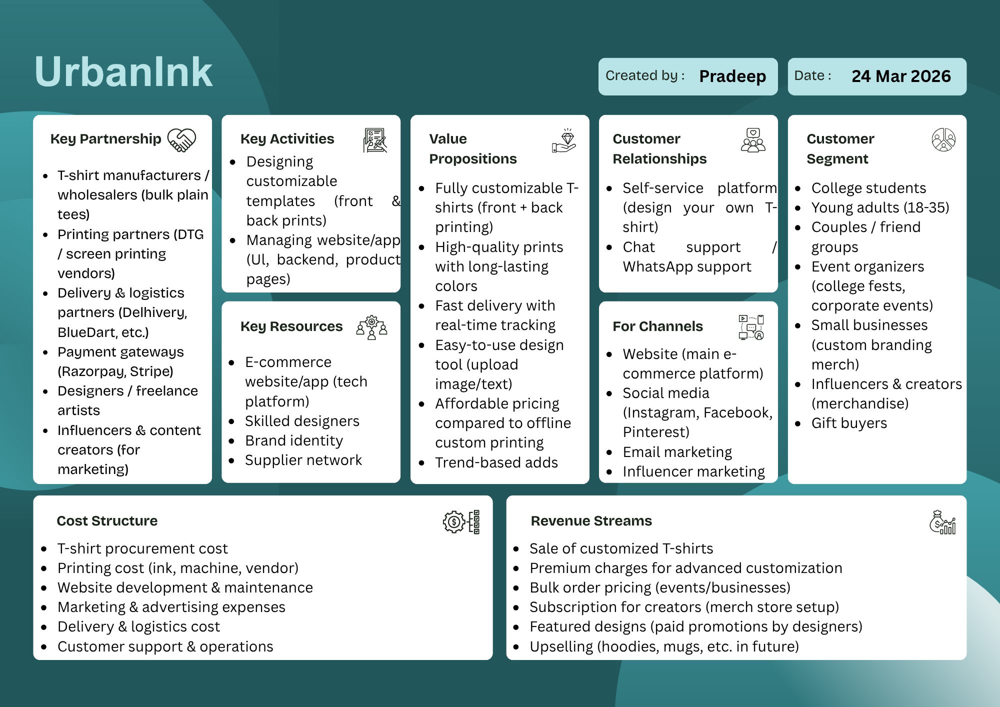

# Lab Assignment 6: Designing a Business Model Canvas for an E-Commerce Idea

## Topic
E-Business Model Development

## Objective
Use the Business Model Canvas (BMC) to outline a business model for a hypothetical E-Commerce startup.

## Tools Used
- Canva
- Business Model Canvas template

## Reference
Eckersley - Chapter 3

## Startup Idea: UrbanInk
UrbanInk is a custom T-shirt e-commerce startup where users can design and order personalized apparel (front and back printing). The platform targets students, young adults, groups, and small businesses that need affordable, high-quality customized products with fast delivery.

## Business Model Canvas Image

## Canvas Description

### 1. Key Partners
- T-shirt manufacturers and wholesalers for bulk plain tees
- Printing partners (DTG and screen printing vendors)
- Delivery and logistics partners (Delhivery, BlueDart, etc.)
- Payment gateways (Razorpay, Stripe)
- Designers and freelance artists
- Influencers and content creators for marketing support

### 2. Key Activities
- Designing customizable templates for front and back prints
- Managing and improving the website/app (UI, backend, product pages)
- Coordinating print production and order fulfillment
- Running digital marketing and influencer campaigns

### 3. Key Resources
- E-commerce website/app (technology platform)
- Skilled design team and creative contributors
- Brand identity and visual assets
- Supplier and printing partner network

### 4. Value Propositions
- Fully customizable T-shirts (front + back)
- High-quality, durable printing
- Fast delivery with real-time tracking
- Easy design process (upload image/text)
- Affordable pricing compared to offline custom printing
- Trend-based design options

### 5. Customer Relationships
- Self-service platform for independent design and ordering
- Chat support and WhatsApp support for quick assistance
- Engagement through social media communities and feedback

### 6. Channels
- Official website (main e-commerce platform)
- Social media channels (Instagram, Facebook, Pinterest)
- Email marketing campaigns
- Influencer marketing collaborations

### 7. Customer Segments
- College students
- Young adults (18-35)
- Couples and friend groups
- Event organizers (college fests, corporate events)
- Small businesses (custom branding merchandise)
- Influencers and creators (personal merchandise)
- Gift buyers

### 8. Cost Structure
- T-shirt procurement costs
- Printing costs (ink, machine usage, vendor fees)
- Website development and maintenance
- Marketing and advertising expenses
- Delivery and logistics costs
- Customer support and operational expenses

### 9. Revenue Streams
- Sales of customized T-shirts
- Premium charges for advanced customization
- Bulk order pricing for events and businesses
- Subscription model for creators (merch store setup)
- Paid promotion for featured designs by designers
- Future upselling (hoodies, mugs, and other products)

## Conclusion
The UrbanInk Business Model Canvas presents a scalable and practical e-commerce model focused on customization, affordability, and digital reach. With strong partner support, clear customer segments, and multiple revenue streams, the startup idea is positioned for both short-term sales and long-term brand growth.
