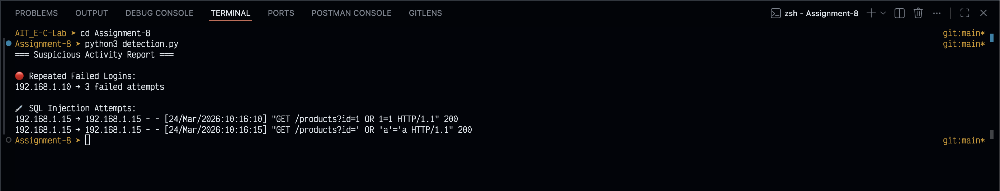

# Lab Assignment 8: Log Analysis and Threat Detection Simulation

## Topic
E-Commerce Security - Best Practices

## Objective
To analyze server logs and detect suspicious activities such as brute force login attempts and SQL injection attacks.

## Tools Used
- Python
- Regex (`re` module)
- `collections.defaultdict` for counting failed attempts
- (Optional) ELK Stack for visualization and large-scale monitoring

## Assignment Context
In an e-commerce environment, web server logs contain critical security signals. This assignment simulates a mini Security Operations workflow by reading raw log entries and identifying suspicious behavior that could indicate account attacks or input-based exploitation attempts.

## Files in This Assignment
- `detection.py` - Main analysis script
- `logs.txt` - Sample simulated server logs
- `Readme.md` - Assignment documentation

## Methodology

### 1. Parse Log File Line by Line
The script opens `logs.txt` and processes each line individually. This approach is memory-efficient and scales well for larger log files.

### 2. Extract Important Fields Using Regex
The following patterns are used:

- IP address pattern:
	- `r"(\d+\.\d+\.\d+\.\d+)"`
- HTTP status code pattern:
	- `r"\" (\d{3})"`
- SQL injection pattern:
	- `r"(OR\s+1=1|\'\s*OR\s*\'a\'=\'a)"`

These expressions capture:
- Source IP of each request
- Response status code (to identify failed authentication)
- Common SQLi payload signatures in URL/query parameters

### 3. Detect Repeated Failed Login Attempts
The script checks each log line for:
- Login endpoint access (`/login`)
- Unauthorized status code (`401`)

For each match, it increments a per-IP counter. Any IP with 3 or more failed attempts is treated as suspicious and flagged as a potential brute force login source.

### 4. Detect SQL Injection Attempts
The script scans every line for SQLi regex matches (case-insensitive). If a payload is detected, it stores:
- Source IP
- Full suspicious log line

This helps preserve evidence for manual investigation and reporting.

## Script Logic Summary
1. Initialize counters and result containers.
2. Read logs line by line.
3. Extract IP and status with regex.
4. Count failed login attempts by IP.
5. Match SQL injection patterns.
6. Print a suspicious activity report.

## How to Run
From the `Assignment-8` directory:

```bash
python3 detection.py
```

## Output Screenshot
The execution output screenshot is included below:



> Note: Keep the screenshot file in the same `Assignment-8` folder with the name `screenshot.png`.

## Expected Output (Based on Current Sample Logs)

### Repeated Failed Login Attempts
- `192.168.1.10` -> 3 failed attempts

### SQL Injection Attempts
- `192.168.1.15` -> `GET /products?id=1 OR 1=1 HTTP/1.1`
- `192.168.1.15` -> `GET /products?id=' OR 'a'='a HTTP/1.1`

## Result
- Identified IPs with multiple failed login attempts.
- Detected SQL injection payloads in query parameters.
- Produced a clear suspicious activity report for security review.

## Security Relevance to E-Commerce
- Repeated login failures can indicate credential stuffing or brute force attacks against customer/admin accounts.
- SQLi patterns indicate attempts to bypass authentication or extract database data.
- Early detection from logs helps reduce impact, trigger alerts, and support incident response.

## Limitations and Improvement Ideas
- Current SQLi detection uses basic signatures; advanced payloads may bypass simple regex.
- Add timestamp-based correlation (for example, attempts per minute).
- Export detections to CSV/JSON for SOC workflows.
- Integrate with ELK Stack to build dashboards and alerts.
- Add unit tests for regex patterns and edge cases.

## Conclusion
This assignment demonstrates a practical and lightweight threat detection workflow using Python and regex. Even with simple logic, server log analysis can reveal high-risk behavior such as brute force login attempts and SQL injection probes in an e-commerce scenario.


